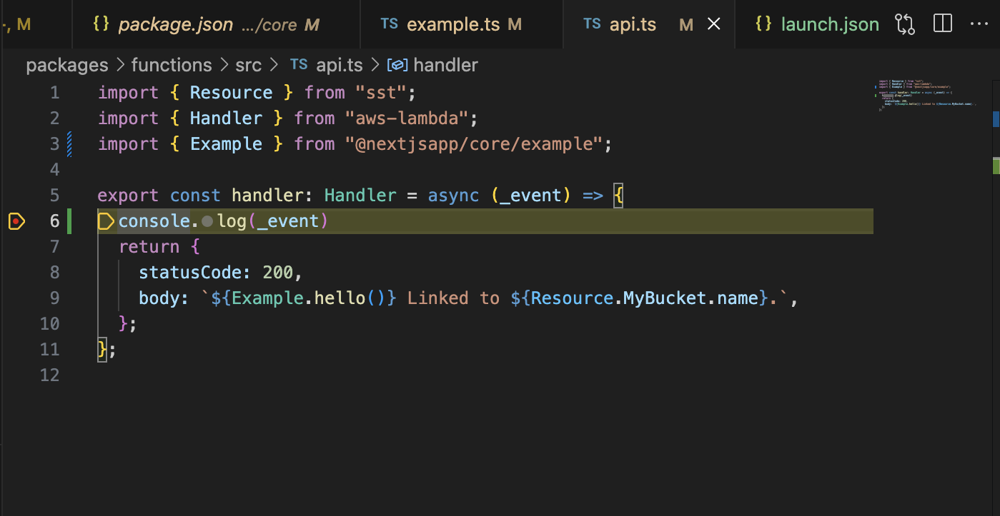

# sst

## 起動

```bash
npm install
```

```bash
# 起動
npx run dev
```

## vscode による debug

> [Ref]  
> How to debug Lambda functions with Visual Studio Code  
> https://guide.sst.dev/examples/how-to-debug-lambda-functions-with-visual-studio-code.html

1. launch.json の作成

`.vscode/launch.json`

```json
{
  "version": "0.2.0",
  "configurations": [
    {
      "name": "Debug SST Dev",
      "type": "node",
      "request": "launch",
      "runtimeExecutable": "${workspaceRoot}/node_modules/.bin/sst",
      "runtimeArgs": ["dev"],
      "console": "integratedTerminal",
      "skipFiles": ["<node_internals>/**"]
    }
  ]
}
```

2. 起動

```bash
npx sst dev
```

3. vscode デバッグ

vscode のデバッグを開始して  
起動後出力された API のエンドポイントを CURL する



## ESLint,Prettier

```bash
npm install --save-dev prettier eslint eslint-config-next eslint-config-prettier eslint-plugin-prettier @typescript-eslint/parser @typescript-eslint/eslint-plugin
```

## 補足（こちらの構成を構築するにあたって）

> [Ref]  
> Set up a Monorepo  
> https://sst.dev/docs/set-up-a-monorepo/

1. モノレポのサンプルを[ここ](https://github.com/sst/monorepo-template)から Clone してくる

2. プロジェクト名を変更する

```bash
npx replace-in-file /monorepo-template/g MY_APP **/*.* --verbose
```

3. npm インストール

```bash
npm install
```

4. 起動

```bash
## リソースにvpcがある場合はこちらも↓
## sudo npx sst tunnel install
npx sst dev
```

5. リソース削除

```bash
npx sst remove
```
